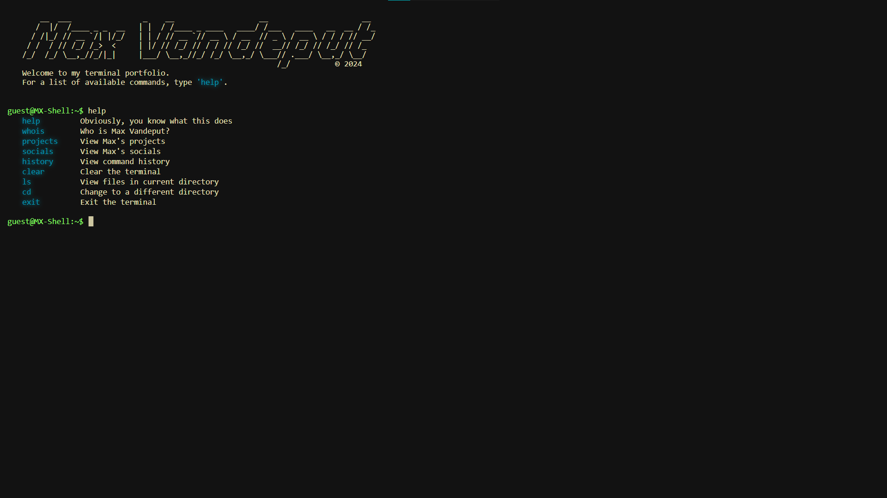

# 
[Max's Terminal Portfolio - v1](https://maxvdp.github.io/portfolio)

 This is the first iteration of my terminal portfolio built with <strong>HTML</strong>, <strong>CSS</strong> and <strong>JavaScript</strong>

 

## Forking this Repository

Feel free to fork this repository to experiment with the code or use it as a starting point for your own projects. If you choose to fork this repository, I kindly ask that you give credit by providing a link back to the original repository.

## Setting up this project

1. Open the index.html

## Credits

I have drawn inspiration from various individuals and sources. Here are the main 3.

- <strong>Linux Terminals</strong>
- <strong>M4TT72:</strong> 
    - [M4TT72's Terminal](https://term.m4tt72.com/)
    - [M4TT72's GitHub](https://github.com/m4tt72/terminal)
- <strong>Twan Mulder:</strong> 
    - [Twan Mulder's Terminal](https://kb5vq.csb.app/)